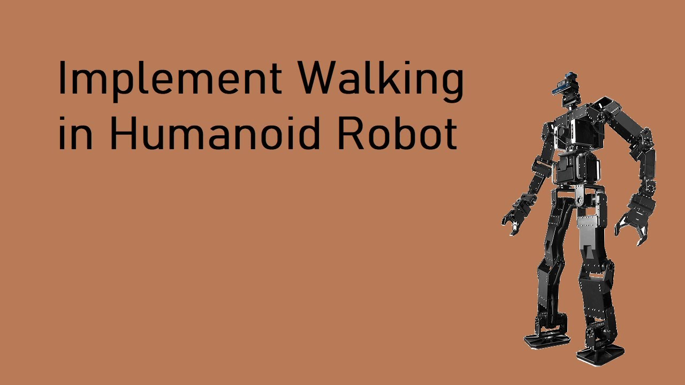

# Humanoid-Robot-1
A humanoid robot project.

## Steps in walking pattern generation (implemented in matlab).
Joint Trajectory Generation is done by following steps.
- ZMP + preview control
- Inverse kinematics for footstep and center of mass trajectory.

## Simulation
The the pattern generated in matlab is tested on an open source humanoid robot in ros called [thormang3](https://github.com/ROBOTIS-GIT/ROBOTIS-THORMANG-Common). The joint trajectories are published to the joint position topic for the humanoid robot to move.

#### Video

